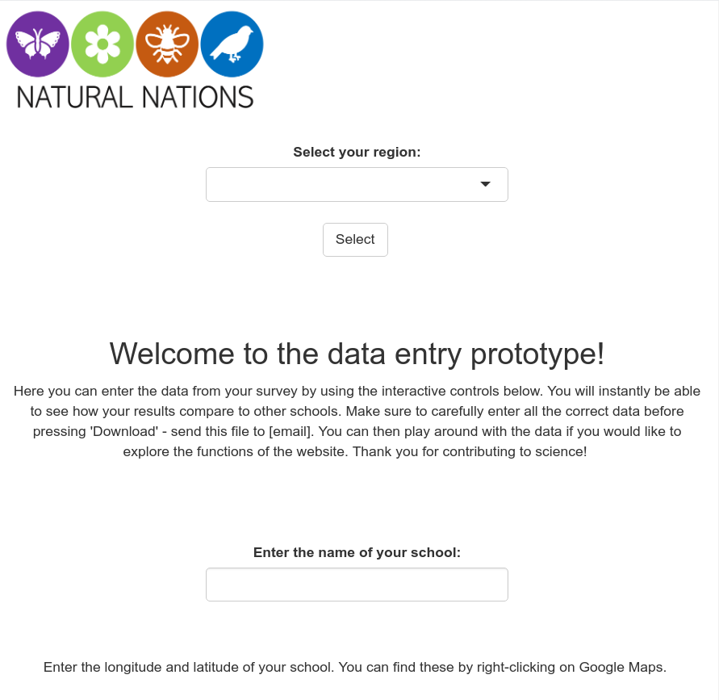

# CitizenScience Project

This repo contains the app that [Johan][1] is developing for his citizen science project in his PhD. This is in colloboration with [NBIS][2] and their bioinformatcs expert [Lokesh][3].

The RShiny app is part of the SMS project [#5557][4]. 

## Preview

[1]: https://portal.research.lu.se/portal/sv/persons/johan-kjellberg-jensen(6b37accd-6d11-4a0a-bb87-072d556fcd49).html
[2]: https://nbis.se
[3]: https://nbis.se/about/staff/lokeshwaran-manoharan/
[4]: https://projects.nbis.se/issues/5557